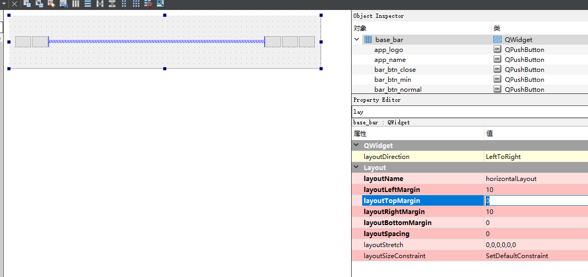

# 组件列表

> 此处应该是一个站点，访问列表copy ui文件

# 一、内置组件

eq自带的组件
## 1.标题栏

### 1.1标题栏0 - FrameBarDemo0

- 效果图：


- ui布局：



- 使用：
```python
# 实例化
self.bar: FrameBarDemo0 = FrameBarDemo0(self)
# 加载到页面容器当中，标题栏应该置顶
self.body_layout.addWidget(self.bar, alignment=Qt.AlignTop)

# 在configure方法中进行配置即可实现上图效果
self.bar_close = self.bar.btn_bar_close
self.bar_mini = self.bar.btn_bar_min
self.bar_normal = self.bar.btn_bar_normal
super(TestActivity, self).configure()
self.bar.btn_bar_app_logo.setIcon(self.resource.qt_icon_project_png)
```