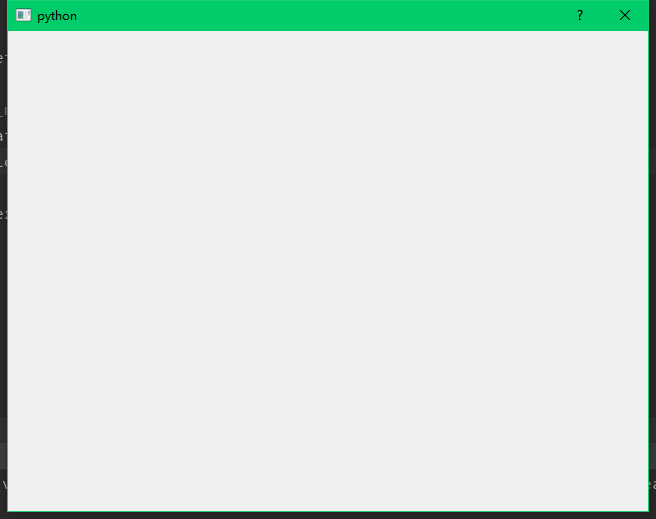
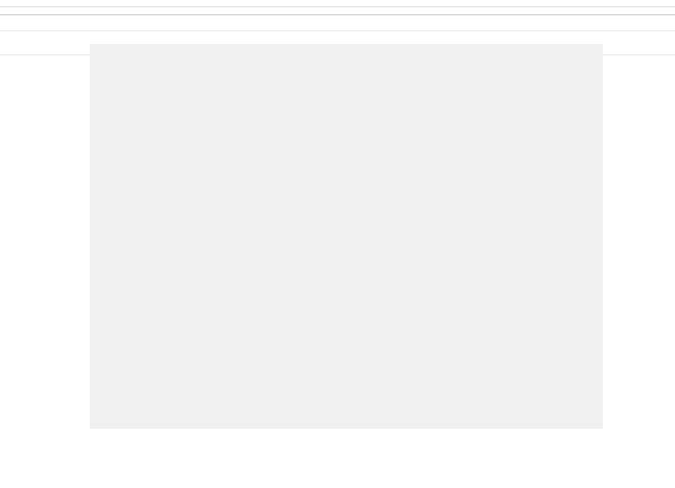
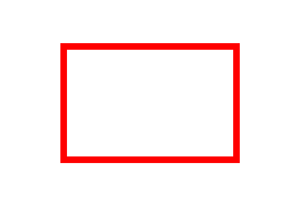
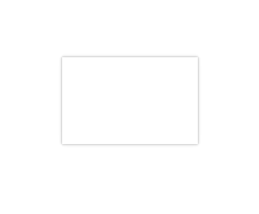
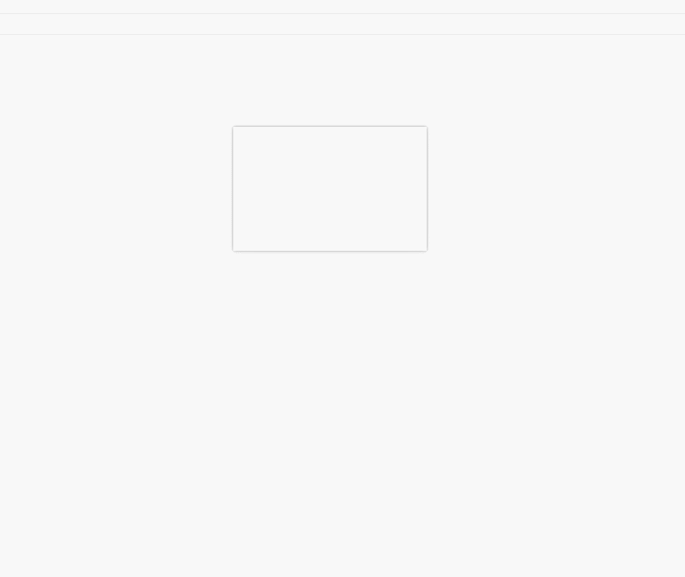

#easy qt for python
本教程意在介绍我们如何制作组件及如何利用组件快速开发。
## 一、 基本窗口
### 1.1 新建一个窗口
- 新建一个空项目
- 新建一个main.py文件，作为程序的主入口
- 在文件中输入：
```python
import sys
from PyQt5.QtWidgets import QApplication, QDialog

if __name__ == '__main__':
    app = QApplication(sys.argv)
    window = QDialog()
    window.show()
    sys.exit(app.exec_())
```
- 运行代码，就可以出现下面的界面。


>ps: 但是我们很多时候并不是都满意系统自带的窗口样式，于是乎。

### 1.2窗口无边框
在以上代码的基础上设定窗口属性为无边框:
```python
import sys
from PyQt5.QtCore import Qt
from PyQt5.QtWidgets import QApplication, QDialog

if __name__ == '__main__':
    app = QApplication(sys.argv)
    window = QDialog()
    window.setWindowFlags(Qt.FramelessWindowHint)
    window.show()
    sys.exit(app.exec_())
```
显示的效果如下：


>ps: 好像跟我们想的有一点不一样，没有边框了，分不清界面，而且不能拖动，不能拉伸，于是乎。

###1.3 窗口阴影
有三个方案：
1. 通过重写paint给窗口绘制一个阴影效果
2. 给窗口的所有边界添加一个阴影图片，通过图片拉伸达到看起来是阴影的效果。
3. 窗口嵌套，用最顶层的窗口作为显示阴影的容器
> 考虑性能、代码侵入性，可扩展，此处采用3。

实现原理：
- 给最顶层窗体设置~~①背景透明~~；②无边框;③窗口大小
- 添加容器，用于放置其他组件，并设置其背景颜色
```python
import sys

from PyQt5.QtCore import Qt
from PyQt5.QtWidgets import QApplication, QDialog, QWidget,QHBoxLayout

if __name__ == '__main__':
    app = QApplication(sys.argv)
    window = QDialog()
    # 设定顶层窗口无边框 
    window.setWindowFlags(Qt.FramelessWindowHint)
    # 添加背景透明属性 
    # window.setAttribute(Qt.WA_TranslucentBackground)
    # 先设置顶层窗口为红色，用于比对
    window.setStyleSheet("background: red")
    window.resize(300, 200)
    widget = QWidget()
    widget.setStyleSheet("background: #fff")
    layout = QHBoxLayout(window)
    layout.addWidget(widget)
    window.show()
    sys.exit(app.exec_())
```
此时，起到的效果，应该是这样的：

- 给主要容器widget添加阴影，同时给顶层窗口设置背景透明
```python

import sys

from PyQt5.QtCore import Qt
from PyQt5.QtWidgets import QApplication, QDialog, QWidget, QHBoxLayout, QGraphicsDropShadowEffect

if __name__ == '__main__':
    app = QApplication(sys.argv)
    window = QDialog()
    # 设定顶层窗口无边框
    window.setWindowFlags(Qt.FramelessWindowHint)
    # 添加背景透明属性
    window.setAttribute(Qt.WA_TranslucentBackground)
    widget = QWidget()
    effect_shadow = QGraphicsDropShadowEffect()
    effect_shadow.setOffset(0, 0)  # 偏移
    effect_shadow.setBlurRadius(10)  # 阴影半径
    effect_shadow.setColor(Qt.darkGray)  # 阴影颜色
    widget.setGraphicsEffect(effect_shadow)
    widget.setStyleSheet("background: #fff")
    layout = QHBoxLayout(window)
    layout.addWidget(widget)
    window.resize(300, 200)
    window.show()
    sys.exit(app.exec_())
```
最终的效果图应该是这样的：

> 看起来是有点感觉，但是不能拖动，不能拉伸，突然觉得系统的边框也不是那么难看（没办法，自己选的嘛偶像， 好在实现起来也不难），于是乎。

### 1.4 窗口拖动
写到此处，会发现代码量在增加，不能再写在方法中，如此不利于重构聚合，所以需要新建一个class，而窗口拖动也恰好需要重写在QWidget下的三个方法：
mousePassEvent（鼠标点击事件）、mouseMoveEvent（鼠标移动事件）、mouseReleaseEvent（鼠标释放事件）。
重新先思考，窗口拖动的流程：鼠标按下->鼠标移动->鼠标释放。
- 新建类，继承Dialog（为什么选择dialog？）
> 为什么选择继承QDialog而不是更上的QWidget？其实两者都差不多。我更乐意用继承QWidget作为组件的父类，QDialog作为页面级别的父类。
- 重写mousePassEvent（鼠标点击事件）、mouseMoveEvent（鼠标移动事件）、mouseReleaseEvent（鼠标释放事件）
> 值得注意的是：鼠标事件中的相对坐标及绝对坐标
main.py
```python

import sys

from PyQt5 import QtGui
from PyQt5.QtCore import Qt, QPoint
from PyQt5.QtWidgets import QApplication, QDialog, QWidget, QHBoxLayout, QGraphicsDropShadowEffect


class BaseActivity(QDialog):

    widget: QWidget = None
    is_move = False  # 是否拖拽
    p_pos: QPoint = None

    def __init__(self):
        super().__init__()
        self.place()
        self.configure()
        self.set_signal()

    def set_signal(self):
        """页面信号"""

    def place(self):
        """页面布局"""
        self.widget = QWidget()
        layout = QHBoxLayout(self)
        layout.addWidget(self.widget)

    def configure(self):
        """页面配置"""
        self.resize(300, 200)
        self.setWindowFlags(Qt.FramelessWindowHint)
        self.setAttribute(Qt.WA_TranslucentBackground)
        self.widget.setStyleSheet("background: #fff")
        effect_shadow = QGraphicsDropShadowEffect()
        effect_shadow.setOffset(0, 0)  # 偏移
        effect_shadow.setBlurRadius(10)  # 阴影半径
        effect_shadow.setColor(Qt.darkGray)  # 阴影颜色
        self.widget.setGraphicsEffect(effect_shadow)
        self.widget.setMouseTracking(True)
        self.setMouseTracking(True)

    def mousePressEvent(self, event: QtGui.QMouseEvent) -> None:
        if event.button() == Qt.LeftButton:
            if event.y() < self.widget.height():
                self.is_move = True
                self.p_pos = event.globalPos() - self.pos()

    def mouseMoveEvent(self, event: QtGui.QMouseEvent) -> None:
        if self.is_move:
            # 此处应该是绝对坐标
            self.move(event.globalPos() - self.p_pos)

    def mouseReleaseEvent(self, event: QtGui.QMouseEvent) -> None:
        self.is_move = False


if __name__ == '__main__':
    app = QApplication(sys.argv)
    window = BaseActivity()
    window.show()
    sys.exit(app.exec_())
```
效果是这样的：

> 似乎一切都很顺利，但是还是差一点，窗口不能拉伸啊，于是乎。

### 1.5 窗口拉伸
方案也是有两个：
1. 重写mousePassEvent（鼠标点击事件）、mouseMoveEvent（鼠标移动事件）、mouseReleaseEvent（鼠标释放事件）。
2. 重写nativeEvent， 通过监听win系统消息实现边框、拖拽、拉伸效果。
> 方案2效果好，但是仅局限于win，并符合qt的跨平台思想，所以选择第一个方案

- 书接上文（沿用上面的代码）
- 对鼠标事件进行监听,不同位置做不同判断(此处仅对右边界进行拉伸操作)

```python
import sys

from PyQt5 import QtGui
from PyQt5.QtCore import Qt, QPoint
from PyQt5.QtWidgets import QApplication, QDialog, QWidget, QHBoxLayout, QGraphicsDropShadowEffect


class BaseActivity(QDialog):

    widget: QWidget = None
    is_move = False  # 是否拖拽
    # 是否在下边界
    is_near_right_border = False
    # 监听边界
    border_width = 5
    p_pos: QPoint = None

    def __init__(self):
        super().__init__()
        self.place()
        self.configure()
        self.set_signal()

    def set_signal(self):
        """页面信号"""

    def place(self):
        """页面布局"""
        self.widget = QWidget()
        layout = QHBoxLayout(self)
        layout.addWidget(self.widget)

    def configure(self):
        """页面配置"""
        self.resize(300, 200)
        self.setWindowFlags(Qt.FramelessWindowHint)
        self.setAttribute(Qt.WA_TranslucentBackground)
        self.widget.setStyleSheet("background: #fff")
        effect_shadow = QGraphicsDropShadowEffect()
        effect_shadow.setOffset(0, 0)  # 偏移
        effect_shadow.setBlurRadius(10)  # 阴影半径
        effect_shadow.setColor(Qt.darkGray)  # 阴影颜色
        self.widget.setGraphicsEffect(effect_shadow)
        self.widget.setMouseTracking(True)
        self.setMouseTracking(True)

    def mousePressEvent(self, event: QtGui.QMouseEvent) -> None:
        """鼠标点击事件"""
        if event.button() == Qt.LeftButton:
            if self.width() - self.border_width * 2 < event.x() < self.width():
                self.is_near_right_border = True
            elif event.y() < self.widget.height():
                self.is_move = True
                self.p_pos = event.globalPos() - self.pos()

    def mouseMoveEvent(self, event: QtGui.QMouseEvent) -> None:
        """鼠标移动事件"""
        if self.is_move:
            # 此处应该是绝对坐标
            self.move(event.globalPos() - self.p_pos)
        if self.width() - self.border_width * 2 < event.x() < self.width():
            self.setCursor(Qt.SizeHorCursor)
        else:
            self.setCursor(Qt.ArrowCursor)

        # 窗口拉伸
        if self.is_near_right_border:
            self.resize(event.pos().x(), self.height())


    def mouseReleaseEvent(self, event: QtGui.QMouseEvent) -> None:
        """鼠标释放事件"""
        self.is_move = False
        self.is_near_right_border = False


if __name__ == '__main__':
    app = QApplication(sys.argv)
    window = BaseActivity()
    window.show()
    sys.exit(app.exec_())
```
 支持所有边界的拉伸效果。
```python
import sys
from typing import Tuple

from PyQt5 import QtGui
from PyQt5.QtCore import Qt, QPoint
from PyQt5.QtWidgets import QApplication, QDialog, QWidget, QHBoxLayout, QGraphicsDropShadowEffect, QPushButton

from view.base_view import BaseView


class BaseActivity(QDialog):
    body_widget: QWidget = None  # 页面上的主要容器，控件应该放在这个里面
    body_layout: QHBoxLayout = None
    bar_normal: QPushButton = None  # 自定义标题栏的最大化最小化及关闭按钮
    bar_close: QPushButton = None
    bar_mini: QPushButton = None
    bar: BaseView = None  # 顶部标题栏
    border_width: int = 5  # 窗口拉伸边界

    class EventFlags:
        """扳机状态，用于判定鼠标事件是否触发"""
        event_flag_bar_move = False
        event_flag_border_left = False
        event_flag_border_right = False
        event_flag_border_top = False
        event_flag_border_bottom = False
        event_flag_border_top_left = False
        event_flag_border_top_right = False
        event_flag_border_bottom_left = False
        event_flag_border_bottom_right = False

        # 不得已以为拉伸闪烁问题
        # 只能设定固定方向的拉伸能够使用
        # 当然全部打开也是可以的，只是存在闪烁问题
        # PC端的应用大部分存在这个问题，所以用也可以
        event_switch_border_left = False
        event_switch_border_right = True
        event_switch_border_top = False
        event_switch_border_bottom = True
        event_switch_border_top_left = False
        event_switch_border_top_right = False
        event_switch_border_bottom_left = False
        event_switch_border_bottom_right = True

        event_position_mouse: QPoint = None

        def __init__(self):
            """进行实例化，不同页面窗体，不同的开关及状态"""

    def __init__(self):
        super().__init__()
        self.event_flags = self.EventFlags()
        self.place()
        self.configure()
        self.set_signal()

    def set_signal(self):
        """页面信号"""

    def place(self):
        """页面布局"""
        self.body_widget = QWidget()
        layout = QHBoxLayout(self)
        layout.addWidget(self.body_widget)

    def configure(self):
        """页面配置"""
        self.resize(300, 200)
        self.setWindowFlags(Qt.FramelessWindowHint)
        self.setAttribute(Qt.WA_TranslucentBackground)
        self.body_widget.setStyleSheet("background: #fff")
        self.bar = self.body_widget
        effect_shadow = QGraphicsDropShadowEffect()
        effect_shadow.setOffset(0, 0)  # 偏移
        effect_shadow.setBlurRadius(10)  # 阴影半径
        effect_shadow.setColor(Qt.darkGray)  # 阴影颜色
        self.body_widget.setGraphicsEffect(effect_shadow)
        self.body_widget.setMouseTracking(True)
        self.setMouseTracking(True)

    def event_flag(self, event: QtGui.QMouseEvent) -> Tuple[bool, bool, bool, bool]:
        """判断鼠标是否移动到边界"""
        top = self.border_width < event.pos().y() < self.border_width + 10
        bottom = self.border_width + self.body_widget.height() < event.pos().y() < self.height()
        left = self.border_width < event.pos().x() < self.border_width + 10
        right = self.border_width + self.body_widget.width() < event.pos().x() < self.width()
        return top, bottom, left, right

    def mousePressEvent(self, event: QtGui.QMouseEvent) -> None:
        """重构鼠标点击事件"""
        if not self.body_widget:
            return super(BaseActivity, self).mousePressEvent(event)
        top, bottom, left, right = self.event_flag(event)
        body_widget_margins = 0 if not self.body_widget.layout() else self.body_widget.layout().getContentsMargins()[1] * 2
        body_widget_spacing = 0 if not self.body_widget.layout() else self.body_widget.layout().spacing()
        # 左键事件
        if event.button() == Qt.LeftButton:
            self.event_flags.event_position_mouse = event.globalPos() - self.pos()
            if top and left and self.event_flags.event_switch_border_top_left:
                self.event_flags.event_flag_border_top_left = True
            elif top and right and self.event_flags.event_switch_border_top_right:
                self.event_flags.event_flag_border_top_right = True
            elif bottom and left and self.event_flags.event_switch_border_bottom_left:
                self.event_flags.event_flag_border_bottom_left = True
            elif bottom and right and self.event_flags.event_switch_border_bottom_right:
                self.event_flags.event_flag_border_bottom_right = True
            elif top and self.event_flags.event_switch_border_top:
                self.event_flags.event_flag_border_top = True
            elif bottom and self.event_flags.event_switch_border_bottom:
                self.event_flags.event_flag_border_bottom = True
            elif left and self.event_flags.event_switch_border_left:
                self.event_flags.event_flag_border_left = True
            elif right and self.event_flags.event_switch_border_right:
                self.event_flags.event_flag_border_right = True
            elif self.bar and self.body_widget and event.y() < self.bar.height() + self.border_width \
                    + body_widget_margins + body_widget_spacing:
                self.event_flags.event_flag_bar_move = True
                self.event_flags.event_position_mouse = event.globalPos() - self.pos()
        return super(BaseActivity, self).mousePressEvent(event)

    def mouseMoveEvent(self, event: QtGui.QMouseEvent) -> None:
        """鼠标移动事件"""
        super(BaseActivity, self).mouseMoveEvent(event)
        if self.body_widget:
            top, bottom, left, right = self.event_flag(event)
            if top and left and self.event_flags.event_switch_border_top_left:
                self.setCursor(Qt.SizeFDiagCursor)
            elif bottom and right and self.event_flags.event_switch_border_bottom_right:
                self.setCursor(Qt.SizeFDiagCursor)
            elif top and right and self.event_flags.event_switch_border_top_right:
                self.setCursor(Qt.SizeBDiagCursor)
            elif bottom and left and self.event_flags.event_switch_border_bottom_left:
                self.setCursor(Qt.SizeBDiagCursor)
            elif top and self.event_flags.event_switch_border_top:
                self.setCursor(Qt.SizeVerCursor)
            elif bottom and self.event_flags.event_switch_border_bottom:
                self.setCursor(Qt.SizeVerCursor)
            elif left and self.event_flags.event_switch_border_left:
                self.setCursor(Qt.SizeHorCursor)
            elif right and self.event_flags.event_switch_border_right:
                self.setCursor(Qt.SizeHorCursor)
            elif Qt.LeftButton and self.event_flags.event_flag_bar_move:
                self.move(event.globalPos() - self.event_flags.event_position_mouse)
            else:
                self.setCursor(Qt.ArrowCursor)
            # 窗口拉伸
            if self.event_flags.event_flag_border_top_left:
                self.setGeometry(self.geometry().x() + event.pos().x(), self.geometry().y() + event.pos().y(),
                                 self.width() - event.pos().x(), self.height() - event.pos().y())
            elif self.event_flags.event_flag_border_bottom_right:
                self.resize(event.pos().x(), event.pos().y())

            elif self.event_flags.event_flag_border_bottom_left:
                self.setGeometry(self.geometry().x() + event.pos().x(), self.geometry().y(),
                                 self.width() - event.pos().x(), event.pos().y())

            elif self.event_flags.event_flag_border_top_right:
                self.setGeometry(self.geometry().x(), self.geometry().y() + event.pos().y(),
                                 event.pos().x(), self.height() - event.pos().y())
            elif self.event_flags.event_flag_border_right:
                self.resize(event.pos().x(), self.height())
            elif self.event_flags.event_flag_border_left:
                self.setGeometry(self.geometry().x() + event.pos().x(), self.geometry().y(),
                                 self.width() - event.pos().x(), self.height())
            elif self.event_flags.event_flag_border_bottom:
                self.resize(self.width(), event.pos().y())
            elif self.event_flags.event_flag_border_top:
                self.setGeometry(self.geometry().x(), self.geometry().y() + event.pos().y(),
                                 self.width(), self.height() - event.pos().y())

    def mouseReleaseEvent(self, event: QtGui.QMouseEvent) -> None:
        """鼠标释放事件"""
        super(BaseActivity, self).mouseReleaseEvent(event)
        self.event_flags.event_flag_bar_move = False
        self.event_flags.event_flag_border_left = False
        self.event_flags.event_flag_border_right = False
        self.event_flags.event_flag_border_top = False
        self.event_flags.event_flag_border_bottom = False
        self.event_flags.event_flag_border_top_left = False
        self.event_flags.event_flag_border_top_right = False
        self.event_flags.event_flag_border_bottom_left = False
        self.event_flags.event_flag_border_bottom_right = False


if __name__ == '__main__':
    app = QApplication(sys.argv)
    window = BaseActivity()
    window.show()
    sys.exit(app.exec_())
```
效果如是这样的：


## 二、组件
如何将已经实现好的自定义窗口组件化，方便二次开发？

### 1.1 约束基类