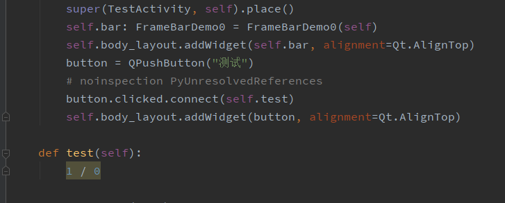
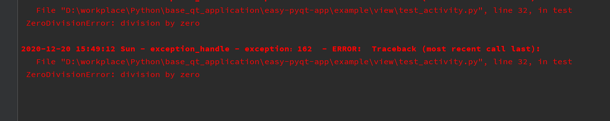

# easy pyqt 使用教程

> 当前尚未发布任何eq版本。

## 快速开始

- 新建页面文件,复制以下代码。

test_activity.py

```python
import sys

from PyQt5.QtWidgets import QApplication

from view.activity.activity_frame_less_window_hint import FrameLessWindowHintActivity


class TestActivity(FrameLessWindowHintActivity):

    def __init__(self, *args, **kwargs):
        super().__init__(*args, **kwargs)
        self.procedure()


if __name__ == '__main__':
    app = QApplication(sys.argv)
    window = TestActivity()
    window.show()
    sys.exit(app.exec_())
```
了了二十行代码即可实现一个基本的自定义窗口。


那我该如何给页面添加布局？请放心，说好的做一个快速开发的pyqt组件，我们自会给你安排上: [eq内置标题栏]()
具体用法可以参考一下代码：
```python
from PyQt5.QtCore import Qt

from view.activity.activity_frame_less_window_hint import FrameLessWindowHintActivity
from view.frame.frame_bar_demo0 import FrameBarDemo0


class TestActivity(FrameLessWindowHintActivity):

    def __init__(self, *args, **kwargs):
        super().__init__(*args, **kwargs)
        self.procedure()

    def place(self):
        """放置布局"""
        super(TestActivity, self).place()
        # 添加默认的标题栏0 
        self.bar: FrameBarDemo0 = FrameBarDemo0(self)
        self.body_layout.addWidget(self.bar, alignment=Qt.AlignTop)

    def configure(self):
        """配置页面及控件属性, 要分清哪些是需要在重写之前，哪些是在重写之后哦"""
        self.bar_close = self.bar.btn_bar_close
        self.bar_mini = self.bar.btn_bar_min
        self.bar_normal = self.bar.btn_bar_normal
        super(TestActivity, self).configure()
        self.bar.btn_bar_app_logo.setIcon(self.resource.qt_icon_project_png)
```
实现的效果是这样的：


## 组件

如果内置的标题栏并不能满足我的要求呢？我应该如何制作一个自己的标题栏？

- 使用qt creator 设计工具设计一个符合要求的ui(变量名可以随意)

如下图：


- 使用脚本工具 pyuic5 转换成py文件
> 我为什么转换成py，而不是动态加载ui？第一点动态加载的ui文件不便于开发，第二不利于面向对象开发
- 新建一个frame文件

具体的文件内容可以参考以下代码
```python
from common.base.base_view import BaseView
from view.uipy.frame_bar import Ui_bar


class FrameBarDemo0(BaseView, Ui_bar):
    """
    标题栏 demo0，继承BaseView及转换后的ui模板文件
    """

    def __init__(self, flags=None, *args, **kwargs):
        super().__init__(flags, *args, **kwargs)
        self.procedure()

    def procedure(self) -> None:
        """实例化流程，在父类实例化之前初始化布局"""
        self.setupUi(self)
        super(FrameBarDemo0, self).procedure()

    def configure(self) -> None:
        """配置文件， 配置ui"""
        super(FrameBarDemo0, self).configure()
        self.set_style('bar.css')
        self.btn_bar_app_name.setText("测试标题栏0")
```

即可生成一个标题栏组件，再将组件放置再页面容器中。
> 什么数据应该放在组件中而不是页面中？什么事件因该放在组件中而不是页面中？
> 租价作为一个可复用的载体，那个性化的数据或者事件就不应该由组件声明，其次作为组件，元素是应该对页面窗口暴露的，即高层组件是可以访问低级组件的。
> 所以重复事件、数据应该被聚合在组件当中，如自定义标题栏FrameBarDemo0 中的btn_bar_app_name 默认是“测试标题栏0”，但也可以在高层组件TestActivity中访问并修改的。

## 全局异常拦截

在代码中我们还不能发现的异常：



在项目运行中运行到异常的代码块时, 全局异常会将其捕获：


同时，也会将异常代码块写入日志文件中：



1. 如果我需要个性化异常拦截，该如何注入到程序中？
- 继承ExceptionHandle
- 实现个性化功能
- 在启动类执行run方法之前，注入到启动类当中，即：
```python

app = EasyQtInit(TestActivity())
app.ex_handle = CustomExceptionHandle()  # 自定义异常拦截
app.run()
```
2. 如果我只想修改异常类的某系属性或者方法呢？
因为异常拦截是全局的单例启动，所以在你的任意代码段执行实例化后修改其属性，也是可以做到全局的属性修改的即：
```python
ExceptionHandle().is_mapping = False  # 不使用中文映射异常提示
```

## 启动类

只是把启动方法聚合成一个类对象，方便修改, 当中包含一些全局的属性
```python
from common.base.eq_init import EasyQtInit
from example.view.test_activity import TestActivity
"""
启动初始化，设置是否唯一启动
:param index_activity: 启动的窗口， 默认是一个Base Activity
:param is_run_unique: 是否需要唯一启动， 默认是True
"""
if __name__ == '__main__':
    EasyQtInit(TestActivity()).run()
```


    

