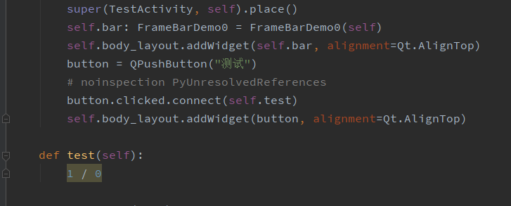
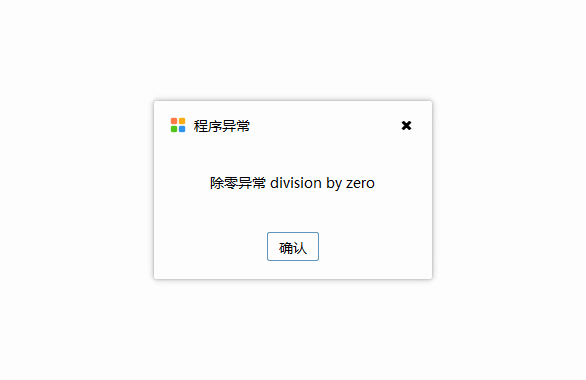
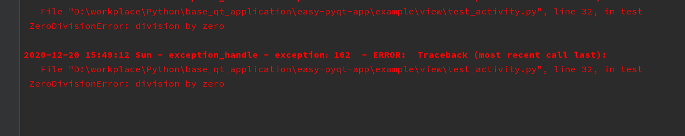

# 代办事项

## 基本窗口-自定义标题栏 √
~~Linux window适配，windows下使用nativeEvent适配，linux使用原生的鼠标事件~~
初始化一个默认的窗口，加载控件需要加载在这个窗体之上，在此已经初始化了大部分会用到的方法功能
如：无边框、自定义标题栏，阴影，拉伸，拖拽，最大最小和关闭事件

## 全局异常信号拦截、全局信号管理 √
- 全局异常管理：为捕获不可预知异常，重写sys.excepthook方法进行异常回溯，对用户进行友好提示，同时异常栈写入到日志文件当中。
被作为窗口base view中的基本属性自上而下继承而来，因为在baseView中继承而下，所以提倡组件跟activity继承自baseView，如此就可以使用大部分通用方法及属性
当然也考虑到不能继承基类的视图，所以应该在初始化入口中声明一次，不必担心重复声明的问题，因为这是一个单例的class。

在代码中我们还不能发现的异常：

在项目运行中运行到异常的代码块时, 全局异常会将其捕获：

同时，也会将异常代码块写入日志文件中：

- 全局信号管理：
pass

## 日志管理 √
通用的日志管理工具，日志工具仅记录三个日志等级：error， warning， info，如果在初始化不传入文件名则日志将以默认的文件名创建，

## 启动类 √
聚合启动类，作为应用级别启动（实现）

## 常用工具类（动态添加）
- 静态资源管理器（实现） √
- 样式读取（实现） √
- 主题皮肤切换功能（待）

## 常用弹窗样式、tip等（动态添加）
弹窗：消息弹窗，警告弹窗，错误弹窗（主题样式可切换）

- 默认弹窗（实现） √

## 按钮样式

## 表格显示、静态表格

## 表单显示

## 颜色选择

## 图表

## 图标

## 动画

## 样式复用

## 导航栏、标题栏、面包屑

## 进度条

## 面板

## 徽章

## 时间选择

## 分页

## 文件上传

## 穿梭框

## 树结构

## 列表结构

## 滑块

## 评分

## 轮播

## 流加载

## 代码编辑器

## PDF阅读

## Excel浏览